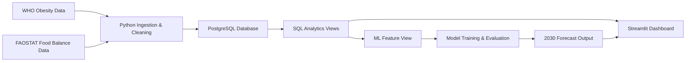

# Sugar Belly  
## Global Obesity Analytics & Machine Learning Forecasting Platform

Sugar Belly is an end-to-end data analytics and machine learning application that explores global obesity trends, sugar and sweeteners availability, and predictive public-health intelligence across countries and WHO regions.

The project combines data engineering, PostgreSQL analytics, SQL-based feature engineering, interactive dashboarding, statistical exploration, machine learning model benchmarking, and obesity forecasting to 2030.

> **Important interpretation note:** This project analyzes associations and forecast scenarios, not causation. FAOSTAT sugar values represent national food supply availability, not exact individual-level consumption.

---

## Executive Summary

Obesity is a growing global public-health challenge, while national food supply patterns provide valuable context for understanding long-term health trends. Sugar Belly was built as a data product to integrate public-health and food-availability datasets into a structured analytics and forecasting platform.

The application enables users to:

- Compare adult obesity prevalence across countries and WHO regions
- Analyze sugar and sweeteners availability patterns
- Explore country-level obesity and sugar availability trends over time
- Compare regional obesity and sugar availability profiles
- Benchmark machine learning models against a naive baseline
- Forecast adult obesity prevalence to 2030 under a constant-sugar scenario

This project demonstrates a professional analytics workflow from raw public datasets to a SQL-backed dashboard and ML forecasting layer.

---

## Dashboard Preview

### Executive Overview


### Global Obesity and Sugar Availability Analytics


### Country-Level Trend Explorer


### ML Forecast to 2030


### Rankings and Comparative Analytics


---

## Business Problem

Public-health and nutrition datasets are often available separately, making it difficult to quickly analyze how obesity prevalence, food availability, and regional differences evolve together over time.

Sugar Belly addresses this by creating a unified analytics layer that connects obesity estimates with food supply indicators, enabling structured exploration, dashboard reporting, and machine learning forecasting.

The project is designed around a practical business question:

> How can public-health and food-availability data be integrated into an analytics product that supports country comparison, regional insight generation, and forward-looking obesity risk forecasting?

---

## Data Sources

This project uses publicly available international datasets.

| Source | Dataset | Usage |
|---|---|---|
| WHO Global Health Observatory | Adult obesity prevalence, BMI >= 30, age-standardized estimate | Country-level obesity trend analysis |
| FAOSTAT Food Balance Sheets | Sugar and sweeteners food supply availability | Country-level sugar availability analysis |

Key fields used include:

- Country ISO3 code
- Year
- Adult obesity prevalence
- Obesity uncertainty bounds
- WHO region
- Sugar and sweeteners supply in kg/capita/year
- Sugar and sweeteners supply in kcal/capita/day

---

## Solution Overview

Sugar Belly follows a modular data-product architecture.



The system separates responsibilities clearly:

- **Python** handles ingestion, cleaning, loading, model training, and forecasting
- **PostgreSQL** stores structured data and powers reusable analytics views
- **SQL views** create dashboard-ready and ML-ready datasets
- **Streamlit and Plotly** deliver the interactive analytics interface
- **Scikit-learn** supports model training, benchmarking, and forecasting

---

## Key Features

### 1. SQL-Backed Analytics Layer

The project uses PostgreSQL tables and SQL views to create a reusable data foundation.

Core database objects include:

- `who_obesity`
- `faostat_sugar_supply`
- `v_obesity_country_year`
- `v_sugar_obesity_country_year`
- `v_sugar_obesity_latest`
- `v_sugar_obesity_region_summary`
- `v_sugar_obesity_country_change`
- `v_ml_obesity_features`

This makes the dashboard more scalable and professional than a CSV-only workflow.

---

### 2. Interactive Dashboard

The Streamlit dashboard provides:

- Executive KPI cards
- Global obesity choropleth map
- Sugar availability choropleth map
- Sugar vs obesity scatter plot with trendline
- Country-level trend explorer
- Regional comparison
- Obesity ranking
- Sugar availability ranking
- Largest obesity increase ranking
- ML forecast to 2030

---

### 3. Machine Learning Forecasting

The ML layer predicts next-year adult obesity prevalence using engineered country-year features.

Features include:

- Current obesity prevalence
- Obesity lag features from previous years
- One-year and three-year obesity changes
- Sugar availability
- Sugar lag features
- One-year and three-year sugar changes
- WHO region
- Year

The model target is:

```text
target_obesity_next_year
```

This means the model learns to predict next-year obesity prevalence from current and historical features.

---

## Model Benchmarking

Three forecasting approaches were compared:

| Model | Purpose |
|---|---|
| Naive Baseline | Predicts next year equals current year |
| Linear Regression | Interpretable statistical ML baseline |
| Random Forest Regressor | Nonlinear tabular ML model |

Model evaluation used a time-based train/test split.

| Split | Years |
|---|---|
| Training period | 2013–2020 |
| Test period | 2021–2022 |

Performance was evaluated using:

- MAE: Mean Absolute Error
- RMSE: Root Mean Squared Error
- R²: Explained variance score

Latest model results:

| Model | MAE | RMSE | R² |
|---|---:|---:|---:|
| Naive Baseline | 0.437 | 0.499 | 0.998 |
| Linear Regression | 0.007 | 0.026 | 1.000 |
| Random Forest Regressor | 0.261 | 0.952 | 0.993 |

The Linear Regression model achieved the lowest MAE on the test period and was selected for forecasting.

> The strong performance is partly explained by the smooth year-to-year nature of WHO obesity estimates and the inclusion of lag and trend features. Results should be interpreted as forecasting of historical estimate patterns, not as deterministic real-world outcomes.

---

## Forecasting Methodology

The selected model was used to forecast adult obesity prevalence through 2030.

Forecasting approach:

1. Start from the latest available country-year data
2. Predict next-year obesity prevalence
3. Add the predicted year back into the country history
4. Use the updated history to predict the following year
5. Repeat until 2030

This is an iterative forecasting approach.

Because future FAOSTAT sugar availability is unknown, the current version uses a baseline scenario:

```text
Future sugar availability is held constant at the latest observed country-level value.
```

This creates a **constant-sugar forecast scenario**.

---

## Technology Stack

| Layer | Tools |
|---|---|
| Data ingestion | Python, Requests, Pandas |
| Data cleaning | Python, Pandas |
| Database | PostgreSQL |
| SQL analytics | SQL views, joins, window functions, correlation |
| Dashboard | Streamlit |
| Visualization | Plotly |
| Machine learning | Scikit-learn |
| Model persistence | Joblib |
| Version control | Git, GitHub |

---

## Project Structure

```text
sugarbelly/
├── app/
│   └── dashboard.py
├── assets/
│   ├── sugarbelly_logo.png
│   ├── sugarbelly_dashboard_overview.png
│   ├── sugarbelly_global_overview.png
│   ├── sugarbelly_ml_forecast.png
│   ├── germany_sugarvsobesity.png
│   └── rankings.png
├── data/
│   ├── raw/
│   ├── interim/
│   └── processed/
├── models/
├── reports/
│   ├── model_metrics.csv
│   ├── test_predictions.csv
│   └── obesity_forecasts_2030.csv
├── sql/
│   ├── 01_create_tables.sql
│   ├── 02_basic_obesity_queries.sql
│   ├── 03_create_obesity_views.sql
│   ├── 04_create_sugar_table.sql
│   ├── 05_create_sugar_obesity_views.sql
│   └── 06_create_ml_features.sql
├── src/
│   ├── cleaning/
│   ├── database/
│   ├── ingestion/
│   └── models/
├── requirements.txt
└── README.md
```

---

## How to Run the Project Locally

### 1. Clone the repository

```bash
git clone https://github.com/pranjal020496/sugarbelly.git
cd sugarbelly
```

### 2. Create and activate environment

```bash
conda create -n sugarbelly python=3.11
conda activate sugarbelly
```

### 3. Install dependencies

```bash
pip install -r requirements.txt
```

### 4. Create PostgreSQL database

Make sure PostgreSQL is running, then create the database:

```bash
createdb sugarbelly
```

### 5. Build database tables and load data

Create WHO obesity table:

```bash
psql -d sugarbelly -f sql/01_create_tables.sql
```

Fetch and clean WHO obesity data:

```bash
python src/ingestion/fetch_who_obesity.py
python src/cleaning/clean_who_obesity.py
python src/database/load_who_obesity.py
```

Create and load FAOSTAT sugar table:

```bash
python src/ingestion/fetch_faostat_sugar.py
psql -d sugarbelly -f sql/04_create_sugar_table.sql
python src/database/load_faostat_sugar.py
```

Create SQL analytics views:

```bash
psql -d sugarbelly -f sql/03_create_obesity_views.sql
psql -d sugarbelly -f sql/05_create_sugar_obesity_views.sql
psql -d sugarbelly -f sql/06_create_ml_features.sql
```

### 6. Train ML models

```bash
python src/models/train_obesity_forecast.py
```

### 7. Generate 2030 forecasts

```bash
python src/models/forecast_obesity_to_2030.py
```

### 8. Run the dashboard

```bash
streamlit run app/dashboard.py
```

The dashboard opens locally at:

```text
http://localhost:8501
```

---

## Key Outputs

| Output | Location |
|---|---|
| Cleaned WHO obesity data | `data/interim/who_obesity_clean.csv` |
| Cleaned FAOSTAT sugar data | `data/interim/faostat_sugar_supply_clean.csv` |
| Model evaluation metrics | `reports/model_metrics.csv` |
| Test predictions | `reports/test_predictions.csv` |
| 2030 forecasts | `reports/obesity_forecasts_2030.csv` |
| Streamlit dashboard | `app/dashboard.py` |

---

## Professional Relevance

This project demonstrates skills relevant to analytics consulting, data engineering, business intelligence, and applied machine learning roles.

It includes:

- End-to-end data pipeline development
- Public data ingestion and cleaning
- Relational database design
- SQL joins, views, window functions, and analytical transformations
- Dashboard development for executive-level insights
- ML feature engineering
- Model benchmarking against a naive baseline
- Forecasting and scenario-based interpretation
- GitHub-based project documentation and version control

---

## Limitations

This project should be interpreted carefully.

- FAOSTAT sugar values represent national food supply availability, not exact personal consumption.
- The analysis identifies associations, not causal relationships.
- Forecasts are scenario-based estimates, not guaranteed future outcomes.
- Future sugar availability is currently held constant at the latest observed value.
- WHO obesity values are estimates and may be revised over time.

---

## Future Enhancements

Potential next steps include:

- Add multiple forecast scenarios:
  - Reduced sugar scenario
  - Constant sugar scenario
  - Increased sugar scenario
- Include socioeconomic indicators such as GDP per capita and urbanization
- Add population-weighted regional summaries
- Deploy the dashboard publicly
- Add model explainability using feature importance or SHAP
- Add automated data refresh pipeline
- Add country clustering and risk segmentation

---

## Author

**Pranjal**  
Data Analytics, Machine Learning, and Public Health Intelligence Project

---