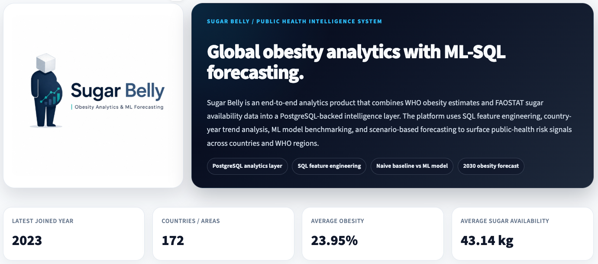
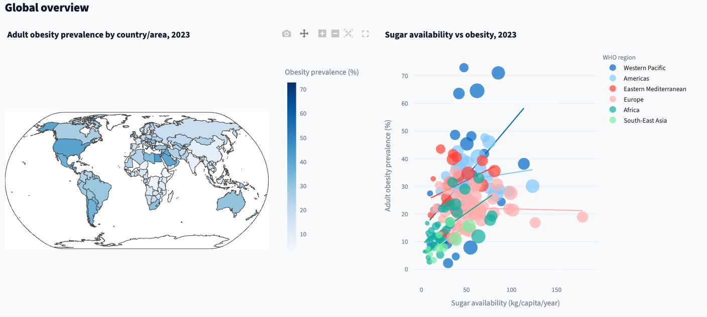
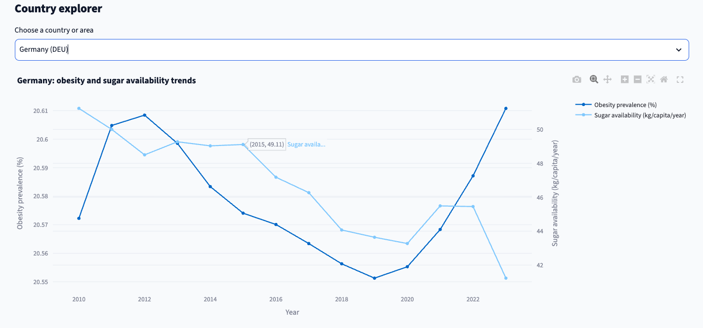
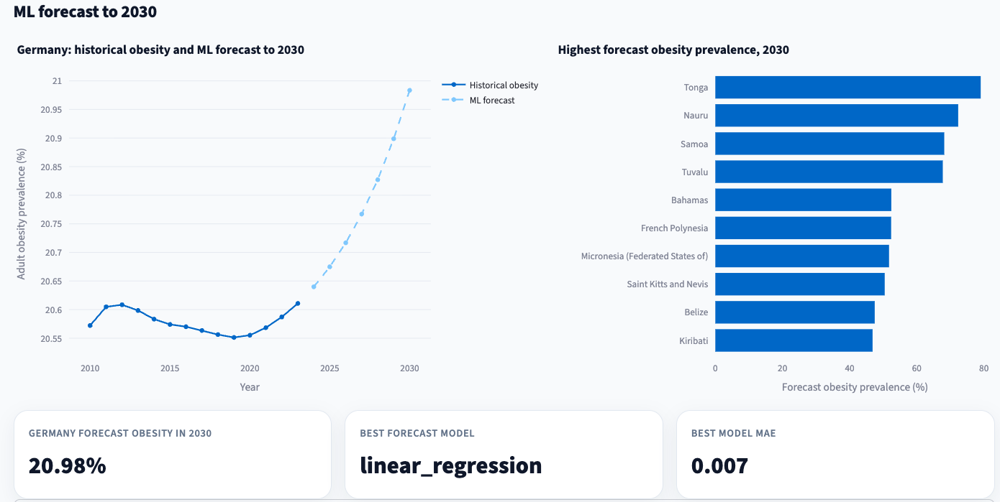
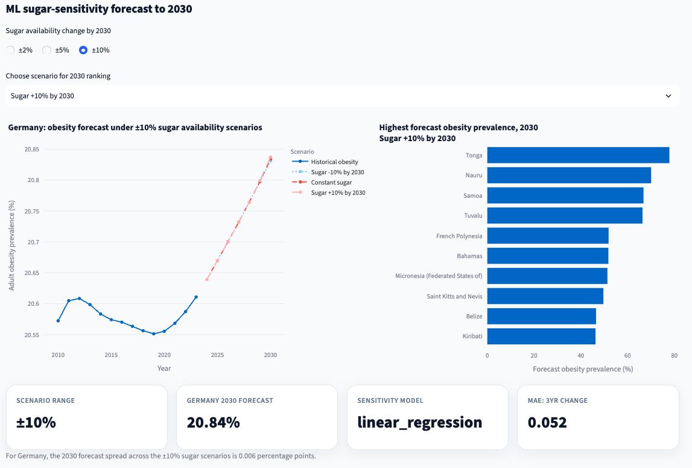
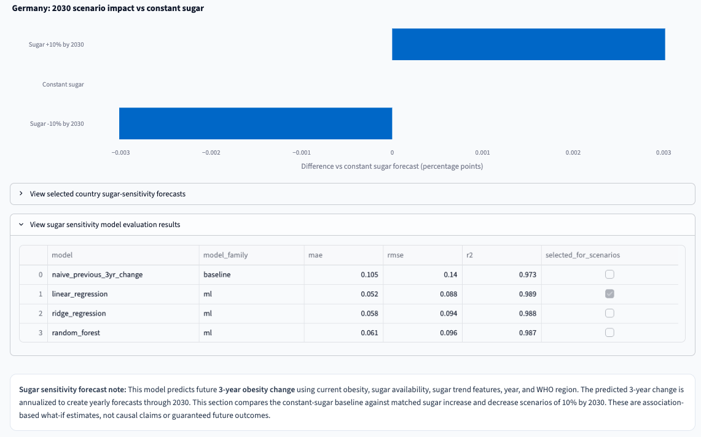
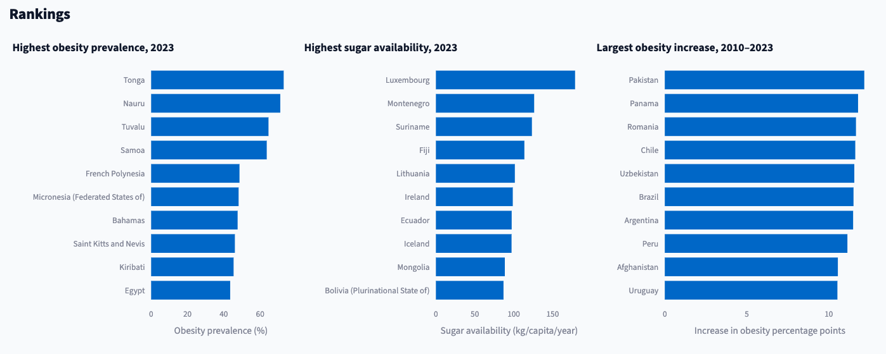
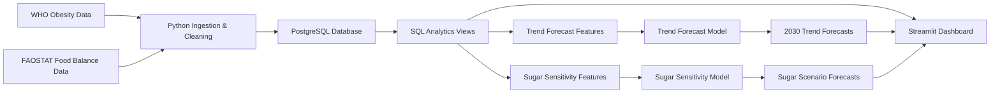

# Sugar Belly  
## Global Obesity Analytics & Sugar-Sensitivity Forecasting Platform

Sugar Belly is an end-to-end data analytics and machine learning platform that explores global obesity trends, country-level sugar and sweeteners availability, and forward-looking obesity risk scenarios across countries and WHO regions.

The project combines data engineering, PostgreSQL analytics, SQL-based feature engineering, interactive dashboarding, machine learning model benchmarking, and scenario-based forecasting to 2030.

> **Important interpretation note:** This project analyzes associations and forecast scenarios, not causation. FAOSTAT sugar values represent national food supply availability, not exact individual-level consumption.

---

## Executive Summary

Obesity is a major global public-health challenge. At the same time, national food supply patterns provide useful context for understanding long-term population health trends.

Sugar Belly was built as a professional analytics product that integrates public-health and food-availability datasets into a structured intelligence platform. It enables users to explore global obesity prevalence, compare sugar availability patterns, evaluate regional trends, and forecast obesity outcomes under different sugar-availability scenarios.

The platform supports:

- Global and regional obesity comparison
- Sugar and sweeteners availability analysis
- Country-level trend exploration
- SQL-backed analytics views
- Machine learning model benchmarking
- Trend-based obesity forecasting
- Sugar-sensitivity scenario forecasting
- 2030 obesity risk comparison across countries and WHO regions

This project demonstrates an end-to-end analytics workflow from raw public datasets to a PostgreSQL-backed dashboard and applied ML forecasting layer.

---

## Dashboard Preview

### Executive Overview



### Global Obesity and Sugar Availability Analytics



### Country-Level Trend Explorer



### Trend-Based ML Forecast to 2030



### Sugar-Sensitivity ML Scenario Forecast



### Scenario Impact vs Constant Sugar



### Rankings and Comparative Analytics



---

## Business Problem

Public-health and nutrition datasets are often published separately. This makes it difficult to analyze how obesity prevalence, food supply availability, country-level differences, and regional patterns evolve together over time.

Sugar Belly addresses this by creating a unified analytics layer that connects WHO obesity estimates with FAOSTAT sugar and sweeteners availability data.

The project is designed around the following analytical question:

> How can public-health and food-availability data be integrated into a decision-support platform that enables country comparison, regional insight generation, and forward-looking obesity scenario analysis?

---

## Data Sources

This project uses publicly available international datasets.

| Source | Dataset | Usage |
|---|---|---|
| WHO Global Health Observatory | Adult obesity prevalence, BMI >= 30, age-standardized estimate | Country-level obesity trend analysis |
| FAOSTAT Food Balance Sheets | Sugar and sweeteners food supply availability | Country-level sugar availability analysis |

Key fields used include:

- Country ISO3 code
- Country or area name
- Year
- Adult obesity prevalence
- Obesity uncertainty bounds
- WHO region
- Sugar and sweeteners supply in kg/capita/year
- Sugar and sweeteners supply in kcal/capita/day

---

## Solution Overview

Sugar Belly follows a modular analytics-product architecture.



The system separates responsibilities clearly:

- **Python** handles ingestion, cleaning, loading, model training, and forecasting
- **PostgreSQL** stores structured data and powers reusable analytics views
- **SQL views** create dashboard-ready and ML-ready datasets
- **Streamlit and Plotly** deliver the interactive analytics interface
- **Scikit-learn** supports model training, benchmarking, and forecasting

---

## Key Features

### 1. SQL-Backed Analytics Layer

The project uses PostgreSQL tables and SQL views to create a reusable analytics foundation.

Core database objects include:

- `who_obesity`
- `faostat_sugar_supply`
- `v_obesity_country_year`
- `v_sugar_obesity_country_year`
- `v_sugar_obesity_latest`
- `v_sugar_obesity_region_summary`
- `v_sugar_obesity_country_change`
- `v_ml_obesity_features`
- `v_ml_sugar_sensitivity_features`

This makes the application more scalable and professional than a CSV-only workflow.

---

### 2. Interactive Dashboard

The Streamlit dashboard provides:

- Executive KPI cards
- Global obesity choropleth map
- Sugar availability choropleth map
- Sugar vs obesity scatter plot with trendline
- Country-level trend explorer
- Regional comparison
- Obesity ranking
- Sugar availability ranking
- Largest obesity increase ranking
- Trend-based ML forecast to 2030
- Sugar-sensitivity scenario forecast to 2030
- Scenario impact comparison versus constant sugar

---

### 3. Machine Learning Forecasting Layer

Sugar Belly uses two complementary ML approaches.

| Model | Purpose |
|---|---|
| Trend Forecast Model | Predicts future obesity using historical obesity trajectory, lag features, sugar availability, region, and year |
| Sugar Sensitivity Model | Estimates future obesity change associated with sugar availability and sugar trend scenarios |

This separation is intentional.

The trend model is optimized for forecast accuracy, while the sugar-sensitivity model is designed for scenario interpretation and decision-support analysis.

---

## Model 1: Trend Forecast Model

The trend forecast model predicts next-year adult obesity prevalence.

The model target is:

```text
target_obesity_next_year
```

Features include:

- Current obesity prevalence
- Obesity lag features from previous years
- One-year and three-year obesity changes
- Sugar availability
- Sugar lag features
- One-year and three-year sugar changes
- WHO region
- Year

Models compared:

| Model | Purpose |
|---|---|
| Naive Baseline | Predicts next year equals current year |
| Linear Regression | Interpretable statistical ML baseline |
| Random Forest Regressor | Nonlinear tabular ML model |

Time-based model evaluation:

| Split | Years |
|---|---|
| Training period | 2013–2020 |
| Test period | 2021–2022 |

Performance:

| Model | MAE | RMSE | R² |
|---|---:|---:|---:|
| Naive Baseline | 0.437 | 0.499 | 0.998 |
| Linear Regression | 0.007 | 0.026 | 1.000 |
| Random Forest Regressor | 0.261 | 0.952 | 0.993 |

The Linear Regression model achieved the lowest MAE on the historical test period and was selected for the original trend forecast.

> The strong performance is partly explained by the smooth year-to-year nature of WHO obesity estimates and the inclusion of strong lag and trend features. These results should be interpreted as forecasting of historical estimate patterns, not as deterministic real-world outcomes.

---

## Model 2: Sugar Sensitivity Model

The sugar sensitivity model was added to better analyze how future obesity may change under different sugar-availability scenarios.

Instead of directly predicting next-year obesity prevalence, this model predicts future obesity movement.

The target is:

```text
target_obesity_change_3yr = obesity_pct in year + 3 - obesity_pct in current year
```

This means the model learns to estimate how much obesity prevalence changes over the following three years.

Input features include:

- Current obesity prevalence
- One-year obesity change
- Three-year obesity change
- Current sugar availability
- Sugar availability one year ago
- Sugar availability three years ago
- One-year sugar availability change
- Three-year sugar availability change
- Sugar availability in kcal/capita/day
- WHO region
- Year

The forecast is calculated as:

```text
future obesity = current obesity + predicted obesity change
```

For yearly forecasts through 2030, the predicted three-year change is annualized.

This model supports sugar-availability scenario analysis, including:

- Sugar -10% by 2030
- Sugar -5% by 2030
- Sugar -2% by 2030
- Constant sugar
- Sugar +2% by 2030
- Sugar +5% by 2030
- Sugar +10% by 2030

The dashboard allows the user to compare matched increase/decrease scenarios using:

```text
±2%, ±5%, and ±10% sugar availability change by 2030
```

---

## Forecasting Methodology

Sugar Belly includes two forecast methodologies.

### Trend Forecast Methodology

The trend forecast model follows an iterative forecasting approach:

1. Start from the latest available country-year data
2. Predict next-year obesity prevalence
3. Add the predicted year back into the country history
4. Use the updated history to predict the following year
5. Repeat until 2030

This creates a baseline obesity forecast based on historical country trajectory and model-learned patterns.

### Sugar Sensitivity Forecast Methodology

The sugar sensitivity model estimates future obesity change under sugar availability scenarios.

The process is:

1. Start from the latest available country-year data
2. Apply a sugar scenario through 2030
3. Build ML features using current obesity, sugar availability, sugar trend, year, and WHO region
4. Predict expected three-year obesity change
5. Annualize the predicted change
6. Add the annualized change to the current obesity value
7. Repeat until 2030

This allows the dashboard to compare obesity forecasts under lower, constant, and higher sugar availability assumptions.

---

## Technology Stack

| Layer | Tools |
|---|---|
| Data ingestion | Python, Requests, Pandas |
| Data cleaning | Python, Pandas |
| Database | PostgreSQL |
| SQL analytics | SQL views, joins, window functions, correlation |
| Dashboard | Streamlit |
| Visualization | Plotly |
| Machine learning | Scikit-learn |
| Model persistence | Joblib |
| Version control | Git, GitHub |

---

## Project Structure

```text
sugarbelly/
├── app/
│   └── dashboard.py
├── assets/
│   ├── sugarbelly_logo.png
│   ├── sugarbelly_dashboard_overview.png
│   ├── sugarbelly_global_overview.png
│   ├── germany_sugarvsobesity.png
│   ├── sugarbelly_ml_forecast.png
│   ├── sugarbelly_ml_sugar_sensitivity_forecast.png
│   ├── sugarbelly_scenario_impact.png
│   └── rankings.png
├── data/
│   ├── raw/
│   ├── interim/
│   └── processed/
├── models/
│   ├── obesity_forecast_model.joblib
│   └── sugar_sensitivity_model.joblib
├── reports/
│   ├── model_metrics.csv
│   ├── test_predictions.csv
│   ├── obesity_forecasts_2030.csv
│   ├── sugar_sensitivity_metrics.csv
│   ├── sugar_sensitivity_test_predictions.csv
│   └── sugar_sensitivity_forecasts_2030.csv
├── sql/
│   ├── 01_create_tables.sql
│   ├── 02_basic_obesity_queries.sql
│   ├── 03_create_obesity_views.sql
│   ├── 04_create_sugar_table.sql
│   ├── 05_create_sugar_obesity_views.sql
│   ├── 06_create_ml_features.sql
│   └── 07_create_sugar_sensitivity_features.sql
├── src/
│   ├── cleaning/
│   ├── database/
│   ├── ingestion/
│   └── models/
│       ├── train_obesity_forecast.py
│       ├── forecast_obesity_to_2030.py
│       ├── train_sugar_sensitivity_model.py
│       └── forecast_sugar_sensitivity_to_2030.py
├── requirements.txt
└── README.md
```

---

## How to Run the Project Locally

### 1. Clone the repository

```bash
git clone https://github.com/pranjal020496/sugarbelly.git
cd sugarbelly
```

### 2. Create and activate environment

```bash
conda create -n sugarbelly python=3.11
conda activate sugarbelly
```

### 3. Install dependencies

```bash
pip install -r requirements.txt
```

### 4. Create PostgreSQL database

Make sure PostgreSQL is running, then create the database:

```bash
createdb sugarbelly
```

### 5. Create tables and ingest data

Create WHO obesity table:

```bash
psql -d sugarbelly -f sql/01_create_tables.sql
```

Fetch, clean, and load WHO obesity data:

```bash
python src/ingestion/fetch_who_obesity.py
python src/cleaning/clean_who_obesity.py
python src/database/load_who_obesity.py
```

Create and load FAOSTAT sugar table:

```bash
python src/ingestion/fetch_faostat_sugar.py
psql -d sugarbelly -f sql/04_create_sugar_table.sql
python src/database/load_faostat_sugar.py
```

### 6. Create SQL analytics views

```bash
psql -d sugarbelly -f sql/03_create_obesity_views.sql
psql -d sugarbelly -f sql/05_create_sugar_obesity_views.sql
psql -d sugarbelly -f sql/06_create_ml_features.sql
psql -d sugarbelly -f sql/07_create_sugar_sensitivity_features.sql
```

### 7. Train the trend forecast model

```bash
python src/models/train_obesity_forecast.py
```

### 8. Generate trend forecasts to 2030

```bash
python src/models/forecast_obesity_to_2030.py
```

### 9. Train the sugar sensitivity model

```bash
python src/models/train_sugar_sensitivity_model.py
```

### 10. Generate sugar sensitivity forecasts to 2030

```bash
python src/models/forecast_sugar_sensitivity_to_2030.py
```

### 11. Run the dashboard

```bash
streamlit run app/dashboard.py
```

The dashboard opens locally at:

```text
http://localhost:8501
```

---

## Key Outputs

| Output | Location |
|---|---|
| Cleaned WHO obesity data | `data/interim/who_obesity_clean.csv` |
| Cleaned FAOSTAT sugar data | `data/interim/faostat_sugar_supply_clean.csv` |
| Trend model metrics | `reports/model_metrics.csv` |
| Trend model test predictions | `reports/test_predictions.csv` |
| Trend model 2030 forecasts | `reports/obesity_forecasts_2030.csv` |
| Sugar sensitivity model metrics | `reports/sugar_sensitivity_metrics.csv` |
| Sugar sensitivity test predictions | `reports/sugar_sensitivity_test_predictions.csv` |
| Sugar sensitivity 2030 forecasts | `reports/sugar_sensitivity_forecasts_2030.csv` |
| Streamlit dashboard | `app/dashboard.py` |

---

## Professional Relevance

This project demonstrates skills relevant to analytics consulting, data engineering, business intelligence, and applied machine learning roles.

It includes:

- End-to-end data pipeline development
- Public data ingestion and cleaning
- Relational database design
- SQL joins, views, window functions, and analytical transformations
- Dashboard development for executive-level insight delivery
- Machine learning feature engineering
- Model benchmarking against naive baselines
- Time-based train/test evaluation
- Forecasting and scenario analysis
- Sensitivity modelling for decision support
- GitHub-based project documentation and version control

---

## Limitations

This project should be interpreted carefully.

- FAOSTAT sugar values represent national food supply availability, not exact personal consumption.
- The analysis identifies associations, not causal relationships.
- Forecasts are scenario-based estimates, not guaranteed future outcomes.
- Sugar availability scenarios are analytical assumptions, not policy predictions.
- WHO obesity values are estimates and may be revised over time.
- Country-level observational data cannot prove individual-level behavioral effects.
- Additional variables such as income, urbanization, demographics, and physical activity could improve future model versions.

---

## Future Enhancements

Potential next steps include:

- Add GDP per capita, urbanization, and population structure features
- Add population-weighted regional summaries
- Add model explainability using feature importance or SHAP
- Add clustering to identify country risk segments
- Add automated data refresh pipeline
- Deploy the dashboard publicly
- Add Docker support for reproducible deployment
- Add a simplified CSV-backed deployment version for Streamlit Community Cloud

---

## Author

**Pranjal**  
Data Analytics, Machine Learning, and Public Health Intelligence Project

---